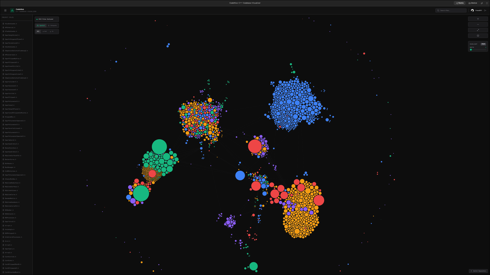

# 🐝 CodeHive: C++ Codebase Visualizer
CodeHive transforms complex, tangled C++ repositories into interactive, spatial maps. By parsing #include hierarchies and leveraging Gemini 3.1 Pro, it provides developers with a "birds-eye view" of their architecture, dependencies, and code logic.



## 🚀 Key Features
### 🕸️ Interactive Spatial Graph
Visualize your entire codebase as a force-directed graph. Nodes represent files, and edges represent #include relationships.
Select on Hover: Instantly view documentation and dependency paths just by gliding your mouse over the "Hive."
Deep Parsing: Recursively explores up to 3 levels of header inclusions to map the full reach of your code.
### 🧠 AI-Powered Documentation
Powered by Gemini 3.1 Pro, CodeHive analyzes the raw source code of any file to generate:
High-level Summaries: Understand what a file does in seconds.
Responsibilities: A bulleted list of the file's primary roles.
Complexity Scoring: Identify potential "God Objects" or refactoring candidates.
### 🔍 Impact Analysis & Reverse Mapping
Don't just see what a file uses—see what uses it.
Dependents View: Instantly list every file that relies on a specific header.
Highlight Modes: Filter the graph to show only inbound (dependents) or outbound (dependencies) relationships.
### 🚩 Git Hotspots
Switch to Hotspot Mode to see a heatmap of your repository. Files are colored based on "Churn" (frequency of changes) from recent Git history, helping you identify high-risk areas that are under heavy development.
### 🏗️ Refactoring Sandbox
Test architectural changes without touching a single line of code.
Virtual Moves: Simulate moving a file to a new directory.
Breakage Prediction: CodeHive calculates exactly which #include paths will break and which files will be affected by the move.
### 🛠️ Technology Stack
Frontend: React, TypeScript, Tailwind CSS, Framer Motion
Visualization: D3.js (Force-directed graph)
AI: Google Gemini 3.1 Pro API
Backend: Node.js, Express
Integration: GitHub REST API (Octokit)
### ⚙️ Getting Started
GitHub OAuth Setup
To use CodeHive with your private or public repositories, you need to configure a GitHub OAuth App:
Go to GitHub Settings > Developer Settings > OAuth Apps > New OAuth App.
Set the Homepage URL and Authorization callback URL to your CodeHive deployment URL.
Add your GITHUB_CLIENT_ID and GITHUB_CLIENT_SECRET to your environment variables.
Environment Variables
Create a `.env` file in the root directory:
```Env
GITHUB_CLIENT_ID=your_id
GITHUB_CLIENT_SECRET=your_secret
GEMINI_API_KEY=your_gemini_key
APP_URL=your_deployment_url
```
### 📖 Usage Guide
Connect: Log in with GitHub to grant CodeHive read access to your repositories.
Select: Choose a repository and a specific subdirectory to analyze.
Explore: Use the graph to navigate. Hover over nodes to see the "Impact Analysis" and AI summaries.
Analyze: Toggle between Spatial and Hotspot views to understand both structure and development activity.
Simulate: Open the Sandbox in the documentation panel to test file migrations.

# Run and deploy your AI Studio app

This contains everything you need to run your app locally.

View your app in AI Studio: https://ai.studio/apps/57291c75-bf45-4db0-8683-404eff7a10dc

## Run Locally

**Prerequisites:**  Node.js


1. Install dependencies:
   `npm install`
2. Set the `GEMINI_API_KEY` in [.env.local](.env.local) to your Gemini API key
3. Run the app:
   `npm run dev`
